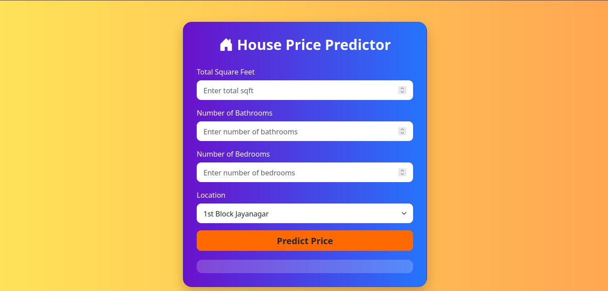
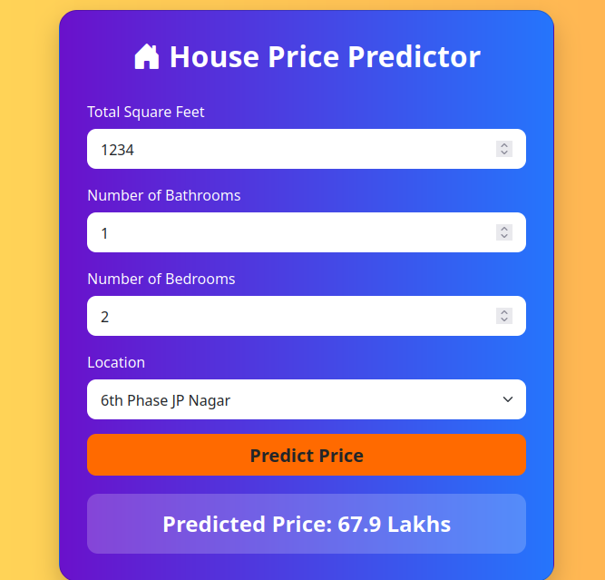

Got it bro ✅ you’re saying you want a **clean single README file** without mixed code blocks and plain text — so you can just copy-paste directly into `README.md`.

Here’s the **final version** all in plain Markdown (no YAML, no mix):

---

# 🏠 House Price Predictor


---

## 📌 Project Overview

The **House Price Predictor** is a Machine Learning web app that predicts house prices based on:

* ✅ Location
* ✅ Total Square Feet
* ✅ Number of Bedrooms (BHK)
* ✅ Number of Bathrooms

The app uses a **Linear Regression model** trained on real estate data and deployed with **Flask**.

---

## 🚀 Tech Stack

* **Frontend:** HTML5, CSS3, Bootstrap
* **Backend:** Flask (Python)
* **Machine Learning:** Linear Regression (`scikit-learn`)
* **Libraries:** Pandas, NumPy, Pickle

---

## ⚙️ Features

* 🔮 Instant price prediction
* 🌍 Location-aware model
* 📊 ML-powered predictions
* 🎨 Modern Bootstrap-based UI
* ⚡ Easy-to-deploy Flask app

---

## 📂 Project Structure

```
├── app.py                 # Flask backend  
├── templates/index.html    # Frontend UI  
├── cleaned_data.csv        # Dataset  
├── LinearModel.pkl         # Trained ML model  
├── requirements.txt        # Dependencies  
├── images/                 # Screenshots folder  
│   ├── homepage.png  
│   └── prediction.png  
└── README.md               # Documentation  
```

---

## 🔧 Installation & Usage

### 1️⃣ Clone the repository

```bash
git clone https://github.com/your-username/house-price-predictor.git
cd house-price-predictor
```

### 2️⃣ Install dependencies

```bash
pip install -r requirements.txt
```

### 3️⃣ Run the Flask app

```bash
python app.py
```

### 4️⃣ Open in browser

Visit 👉 [http://127.0.0.1:5000/](http://127.0.0.1:5000/)

---

## 🖼️ Output Screenshots

### 🌐 Homepage UI



### 📊 Prediction Result



---

## 📊 Model Performance

* Algorithm: **Linear Regression**
* Metrics used: R² Score, Mean Absolute Error, Mean Squared Error
* *(Add your evaluation results here)*

---

## 🌟 Future Improvements

* 🔥 Try Random Forest & XGBoost for higher accuracy
* ☁️ Deploy on AWS / Heroku
* 📱 Add a React frontend
* 🧠 Add Deep Learning models for better predictions

---

## 🤝 Contributing

Pull requests are welcome! Open an issue first to discuss changes.

---

## 📬 Contact

👤 **Vedant Dhawade**

* GitHub: [your-username](https://github.com/your-username)
* LinkedIn: [your-linkedin](https://linkedin.com/in/your-linkedin)
* Email: [yourmail@gmail.com](mailto:yourmail@gmail.com)

---

⭐ If you like this project, don’t forget to **star this repo**!

---

👉 This is now a **pure Markdown file**. Just copy-paste into `README.md` and push to GitHub.

Do you also want me to prepare the **requirements.txt** so your repo works instantly when someone clones it?
